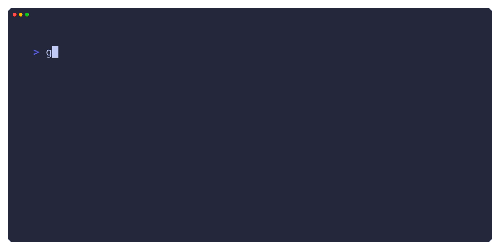

## Dependencies

You need those tools:

- `CMake >= 3.14`

- `Git`

- `Python`

### macOS

```bash
brew install git cmake python
```
### Linux

Use your package manager to install dependencies

```bash
sudo apt install git cmake python
```

### Windows

You need to install the Visual Studio, and:

```bash
winget install Git.Git Python CMake.

```


## Usage



- Create a build folder:

```bash
cmake -B build
```

if you want to use other build tools, like Ninja:

```bash
cmake -B build -G Ninja
```

- Build Project:

```bash
cmake -B build
```

This command should invokes the building tool that you set before.

- Run the Executable File

```bash
./build/learnopengl
```
**For Windows User:**

The output `learnopengl.exe` should be in `./build/Debug` folder.

## Utilities

Your Text Ediotr may need the `compile_commands.json` to do autocompleting, you can build projects first then copy `compile_commands.json` from the `build` folder.

### VSCode

For VSCode user, you need `ms-vscode.cmake-tools`, `ms-vscode.cpptools` and `twxs.cmake` those three extensions. When you opened this project, VSCode should will tell you to install them.

After opening project, you should use `>CMake: Select Configure Preset` to select build preset and `>CMake: Select Build Preset` to select target preset.

Due to the limitation of `ms-vscode.cmake-tools`, you can not change current working dictionary of target program, highly recommend using terminal to launch target program.

## Customization

Please Read [`CMakeLists.txt`](./CMakeLists.txt) for more information.

